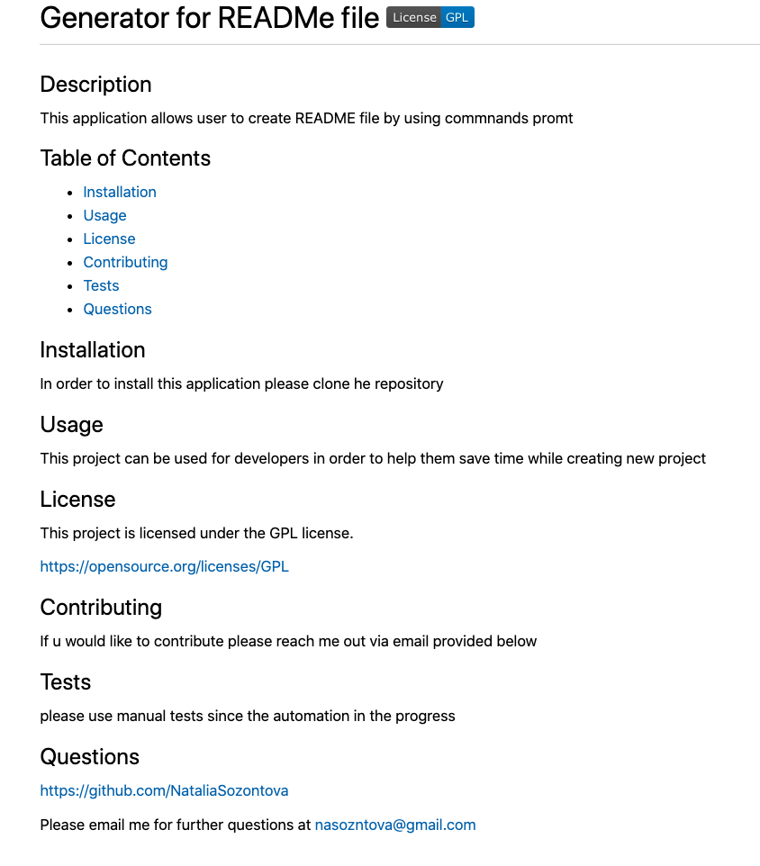
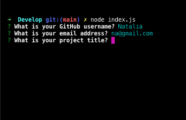
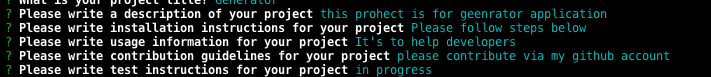
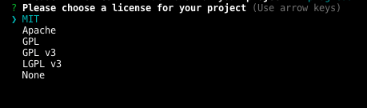
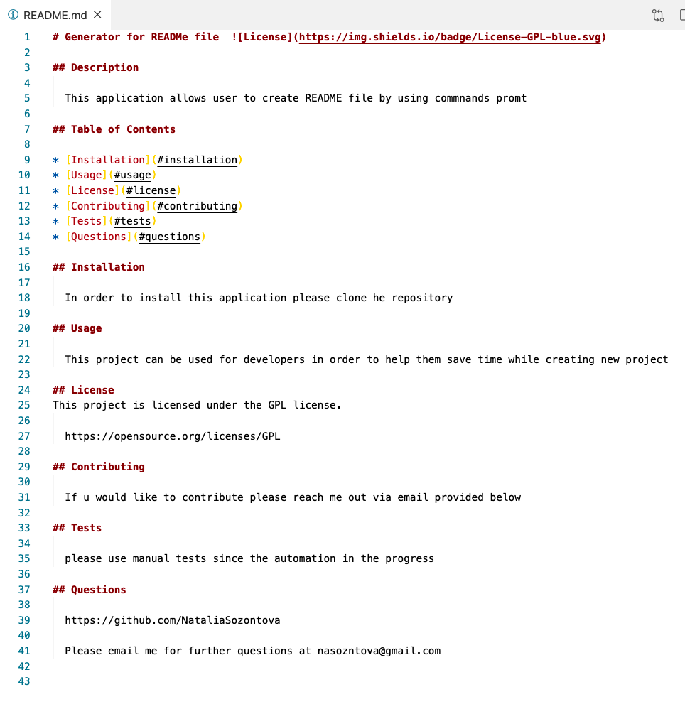

# ReadMe file Generator

## Description
This Application allows users to create a README file by using a command-line

## Table of Contents
* [Features](#features)
* [Installation](#installation)
* [Known Bugs](#known-bugs)
* [Support](#support)
* [Technologies Used](#technologies-used)
* [Contribution Guidlines](#contribution-guidlines)
* [License](#license)

## Features
* Project title generation

* Project description generation

* License generation

* Project sections generation

* Generated file 

## Installation 
* Clone this repository.
* Open repository in your browser.
* Follow instructions on the video:

https://drive.google.com/file/d/17d_Yrfgmyy9lU7h4Mnw2i8vPvAVZRO5n/view?usp=sharing

## Known Bugs
None

## Support
Please email me for further questions at nasozontova@gmail.com

## Technologies Used
NodeJS
JavaScript

## Contribution Guidlines
Direct link to repository: https://github.com/NataliaSozontova/homeworkWeek10ReadMeGenerator

## License
Copyright(c) 2021 Natalia Sozontova.